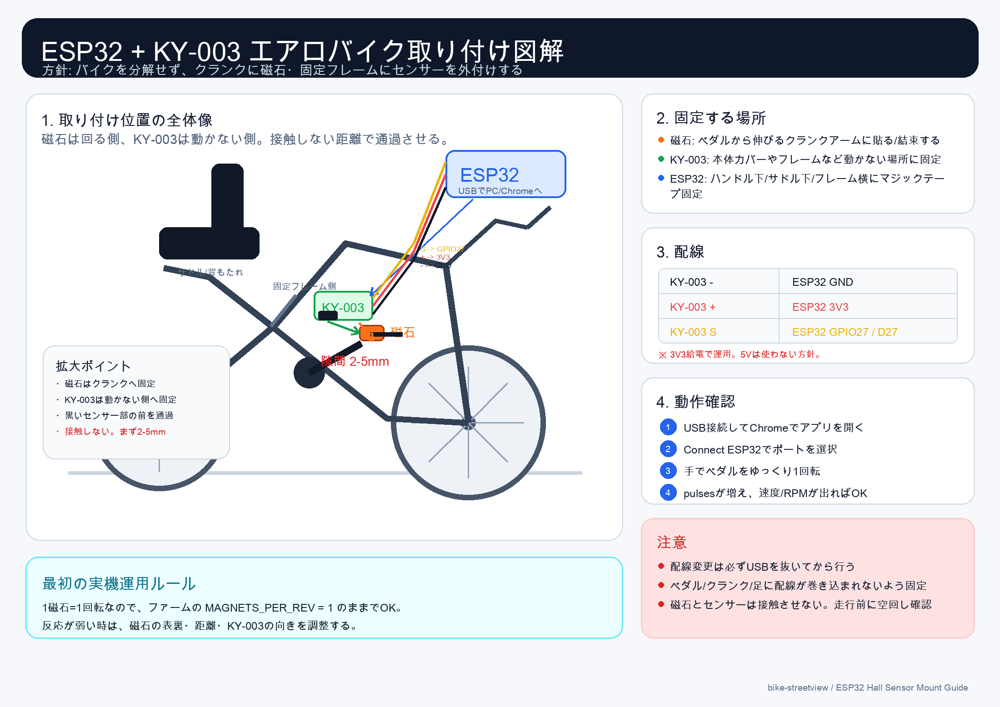

# Bike Street View

## 概要

エアロバイクの回転数に合わせてGoogle Street View上を疑似走行する、屋内サイクリング用Webアプリのプロトタイプ。

主な目的は、室内のエアロバイクでも「実際のルートを進んでいる感覚」を作ること。現在はキーボード入力、仮想ESP32、ESP32 + KY-003実機の机上テストまで進んでいる。

## 現在の状態

| 項目 | 状態 |
|---|---|
| キーボード走行 | 実装済み |
| 仮想ESP32 | 実装済み |
| ESP32 + KY-003机上テスト | 完了 |
| Web Serial接続 | NDJSON形式で動作確認済み |
| 本体アプリESP32接続 | 確認済み |
| ルート選択 | 固定ルート + ブラウザ作成ルートに対応 |
| ルート作成 | 出発地・目的地・経由地から作成可能 |
| Street View更新 | 100mごとに更新 |
| 現在地表示 | 都道府県・市区町村・町名まで表示 |
| 標高・勾配 | Elevation API取得、平滑化、勾配補正に対応 |
| 進捗保存 | Street View更新成功時に自動保存 |
| エアロバイク実機取り付け | 未実施 |

## 主要機能

- ルート選択画面から走行ルートを選択
- ブラウザ上で新規ルート作成
- Google Routes APIでルート生成
- 自転車ルートが返らない場合は車ルート代替
- Google Elevation APIで標高取得
- 勾配値を平滑化して急なブレを抑制
- Google Maps JavaScript APIのStreet View表示
- Street Viewがない地点では近傍探索
- 走行進捗をブラウザ`localStorage`へ自動保存
- リセット操作は確認ダイアログ付き
- Web Serial APIでESP32のRPM入力を受信
- 実機なしでも仮想ESP32で動作確認可能

## 技術構成

| 領域 | 内容 |
|---|---|
| フロントエンド | React + Vite + TypeScript |
| 地図・SV | Google Maps JavaScript API |
| ルート生成 | Google Routes API |
| 標高 | Google Elevation API |
| 現在地表示 | Geocoding API |
| センサー入力 | Web Serial API |
| 実機 | ESP32 Dev Board + KY-003ホールセンサー |
| テスト | Vitest |
| 保存 | ブラウザ`localStorage` |

## Google API

必要なAPI:

- Maps JavaScript API
- Geocoding API
- Routes API
- Elevation API

環境変数:

```dotenv
VITE_GOOGLE_MAPS_API_KEY=
GOOGLE_ROUTES_API_KEY=
GOOGLE_ELEVATION_API_KEY=
```

注意:

- `.env.local`は共有・コミットしない
- `VITE_GOOGLE_MAPS_API_KEY`はHTTPリファラー制限向き
- `GOOGLE_ELEVATION_API_KEY`はHTTPリファラー制限付きキーでは失敗する
- 開発ポートを変えると、Google APIキーのHTTPリファラー制限でブロックされることがある

## ESP32実機検証

### 確認済み

- Arduino IDE 2.xでESP32へファームウェアを書き込み
- ESP32からUSBシリアルでNDJSONを出力
- ChromeのWeb Serial APIで接続
- KY-003に磁石を近づけると`pulses`と`rpm`が変化
- 本体アプリの`ESP32接続`で速度/RPM変化を確認

### ファームウェア

リポジトリ内:

```text
firmware/esp32_hall_rpm/esp32_hall_rpm.ino
```

主な設定:

| 項目 | 値 |
|---|---|
| Baud rate | `115200` |
| Hall sensor pin | `GPIO27` |
| Magnets per rev | `1` |
| Report interval | `1000ms` |

出力例:

```json
{"status":"boot","message":"esp32_hall_rpm_ready"}
{"pulses":1,"rpm":60.0,"timestamp_ms":123456}
```

### 配線

| KY-003 | ESP32 |
|---|---|
| `-` | `GND` |
| `+` | `3V3` |
| `S` | `GPIO27` / `D27` / `27` |

安全ルール:

- KY-003は`3V3`給電で運用する
- `5V`給電は使わない
- ESP32 GPIOへ5V信号を直結しない
- 配線変更時は必ずUSBを抜く

## エアロバイク取り付け方針

分解せず、外側から仮固定して検証する。

| 部品 | 取り付け先 |
|---|---|
| 磁石 | ペダルから伸びるクランクアーム |
| KY-003 | 本体カバー、フレームなど動かない場所 |
| ESP32 | ハンドル下、サドル下、フレーム横など |

実機検証ルール:

1. まず仮固定で確認する
2. 磁石とセンサーは接触させない
3. 距離はまず`2〜5mm`程度で試す
4. ケーブルをペダル・クランク・足に巻き込ませない
5. 走行前に必ず手回しで干渉確認する
6. 問題なければ結束バンドや両面テープで本固定する

図解:



PDF版: [esp32_airbike_mount_guide.pdf](./output/pdf/esp32_airbike_mount_guide.pdf)

## 実際に詰まった点

| 症状 | 対処 |
|---|---|
| ViteがNode.js 16で起動しない | Node.js `20.19+`へ切り替える |
| ESP32ボード候補が多い | `esp32 by Espressif Systems`の`ESP32 Dev Module`を選ぶ |
| Portが複数出る | Macでは`/dev/cu.usbserial-*`系を選ぶ |
| Uploadで止まる | Upload Speedを`115200`へ下げる。必要なら`BOOT`押しながらUpload |
| Serial Monitorが文字化け | Baud rateを`115200`へ合わせる |
| Web Serialで`No port selected` | ポート選択ダイアログでESP32ポートを選び直す |
| `WARN: JSON parse skipped` | ESP32起動ログなど非JSON行の読み飛ばしなので問題なし |
| 磁石に反応しない | 磁石の表裏、距離、`S/+/-`配線、`GPIO27`を確認 |
| 別ポートでGoogle APIがブロック | APIキーのHTTPリファラー制限に追加するか`5173`を使う |

## 開発コマンド

```bash
cd /Users/k-hayashi/workspace/p-dc/bike-streetview
PATH="$HOME/.nvm/versions/node/v20.19.5/bin:$PATH" npm run dev -- --host 127.0.0.1 --port 5173
```

テスト:

```bash
npm test
npm run build
```

## 関連ドキュメント

リポジトリ側:

- `/Users/k-hayashi/workspace/p-dc/bike-streetview/README.md`
- `/Users/k-hayashi/workspace/p-dc/bike-streetview/README_TEAM.md`
- `/Users/k-hayashi/workspace/p-dc/bike-streetview/README_ESP32_HANDOFF.md`
- `/Users/k-hayashi/workspace/p-dc/bike-streetview/web-serial-test/README.md`


## 残タスク

| タスク | 状態 |
|---|---|
| エアロバイクへの磁石/KY-003仮固定 | 未実施 |
| ペダル回転中のRPM安定性確認 | 未実施 |
| センサー固定方法の最終決定 | 未実施 |
| RPMから実走速度への係数調整 | 未実施 |
| GPX・GeoJSONインポート | 候補 |
| 走行ログ出力 | 候補 |
| スマホリモコン / BLE化 | 候補 |

## チーム共有時の要点

- このプロトタイプは、エアロバイクの回転をStreet View移動に変換するWebアプリ
- ESP32 + KY-003 + 磁石1個でRPM入力を取る
- 実機机上テストは完了、本番の山場はエアロバイクへの安全な固定
- 最重要注意は`3V3`給電、配線巻き込み防止、磁石とセンサー非接触
- Google APIキーは共有物に含めない
- Chrome系ブラウザが必須
